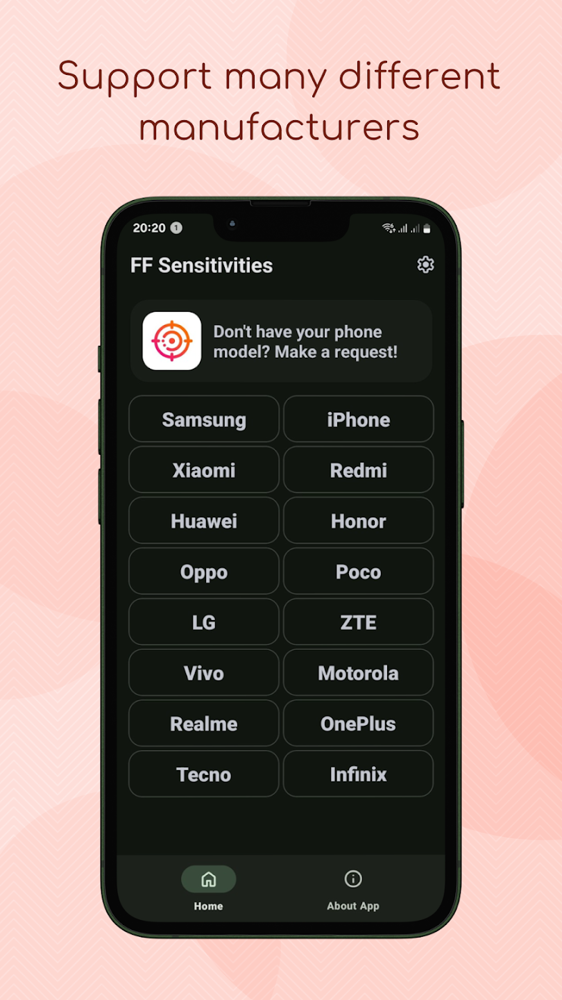
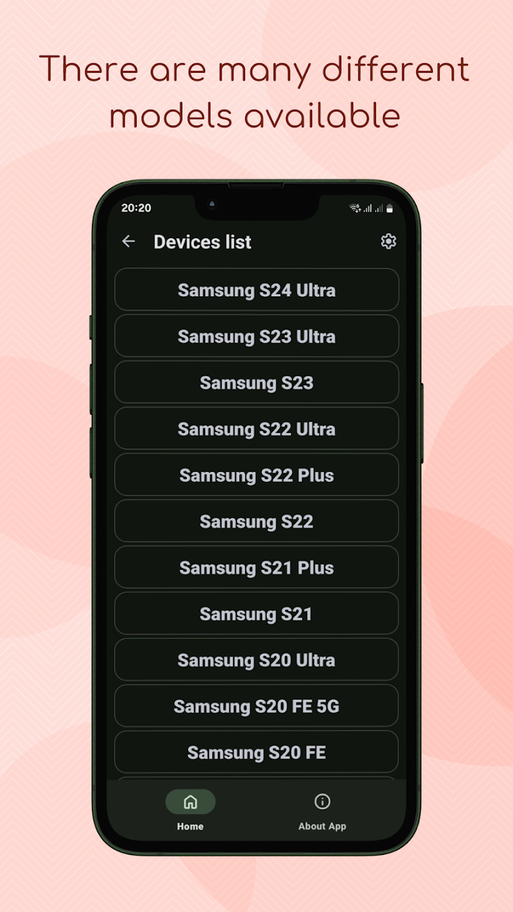

# FF Settings 

**FF Settings** is an open-source app designed for gamers who are constantly seeking the perfect sensitivity settings to enhance their in-game performance.

With our app, you'll always have the latest and most relevant sensitivity settings for a variety of devices from different manufacturers, helping you boost your rank and reputation among friends and the community.

## Features

- **Cloud Technology**  
  New sensitivity settings appear without needing to update the app.

- **Multilingual Support**  
  Supports multiple languages, with new ones being added regularly.

- **Multiple Manufacturers**  
  Includes settings for devices from more than 12 different manufacturers.

- **Minimalist UI**  
  Simple, self-explanatory interface without overloaded menus.

> **Note**: On the screenshots, the names of well-known manufacturers are displayed for demonstration purposes. This does not imply endorsement or association with the application.

## Open Source

This project is open-source, and the code is available for anyone to view, use, or contribute to.  
Feel free to check out the source code in this repository and submit issues or pull requests if you'd like to contribute.

- **Repository**: [GitHub Repository](https://github.com/byteflipper/FFSettings)
- **License**: This project is licensed under the MIT License. See the [LICENSE](LICENSE) file for more details.

## Screenshots & Video

  
  
  
  

## Download

Download the app from the Google Play Store:

## Contact Us

- **Website**: [https://byteflipper.web.app/](https://byteflipper.web.app/)
- **VK**: [https://vk.com/byteflipper](https://vk.com/byteflipper)
- **Telegram**: [https://t.me/byteflipper](https://t.me/byteflipper)
- **Telegram Support**: [https://t.me/byteflipper_feedback_bot](https://t.me/byteflipper_feedback_bot)
- **Email**: [byteflipper.business@gmail.com](mailto:byteflipper.business@gmail.com)
