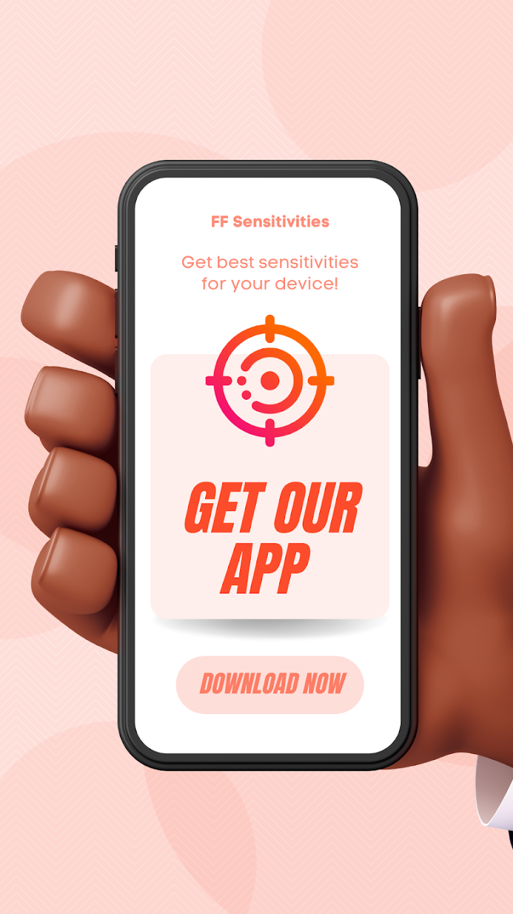
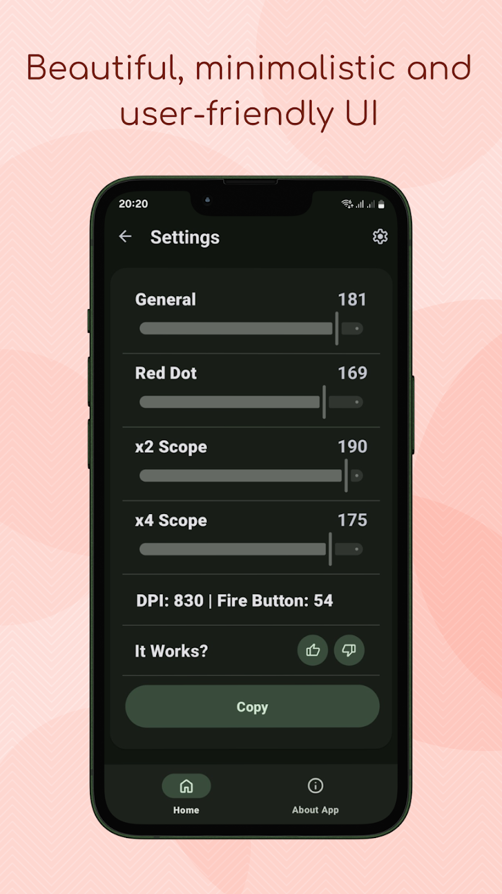

# FF Settings 

**FF Sensitivities** is an open-source app designed for **Garena Free Fire** players who want to find the optimal sensitivity settings for their mobile devices and enhance their gameplay.

Recently, the app was rewritten using **Jetpack Compose**, improving performance and enhancing the user interface.

## Features

- **Cloud Technology**  
  New sensitivity settings are updated without the need for app updates.

- **Multilingual Support**  
  Support for multiple languages, with new ones added regularly.

- **Support for Various Manufacturers**  
  Sensitivity settings for devices from over 12 different manufacturers.

- **Minimalist Interface**  
  A simple and user-friendly interface without cluttered menus.

> **Note**: The screenshots feature names of well-known manufacturers for demonstration purposes only. This does not imply endorsement or association with the app.

## Open Source  

The project is **open-source**, and the code is available for review, use, or contribution.  
You can explore the source code in the repository, leave feedback, or submit a **pull request** if you'd like to contribute.

- **Legacy Version Source Code**: [FF Sensitivities](https://github.com/byteflipper/FFSettings) — the original project built with traditional development approaches using **Java** + **Views**.  
- **New Version Source Code**: [FF Sensitivities 2.0](https://github.com/byteflipper/FFSettings) — the updated version, completely rewritten with **Jetpack Compose** for a modern and user-friendly interface.
- **License**: This project is licensed under the MIT License. See the [LICENSE](LICENSE) file for more details.

## Screenshots & Video

  
  
  
  

## Download

Download the app from the Google Play Store:

## Contact Us

- **Website**: [https://byteflipper.web.app/](https://byteflipper.web.app/)
- **VK**: [https://vk.com/byteflipper](https://vk.com/byteflipper)
- **Telegram**: [https://t.me/byteflipper](https://t.me/byteflipper)
- **Telegram Support**: [https://t.me/byteflipper_feedback_bot](https://t.me/byteflipper_feedback_bot)
- **Email**: [byteflipper.business@gmail.com](mailto:byteflipper.business@gmail.com)
